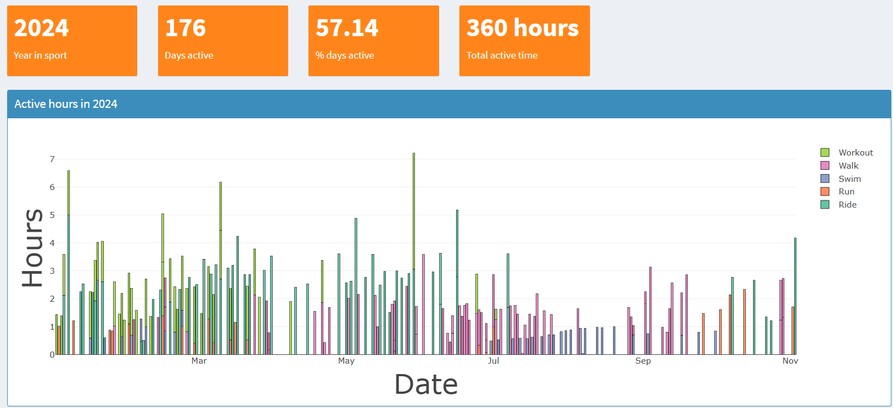
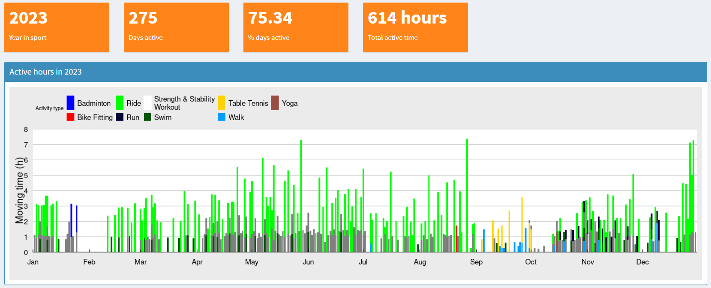
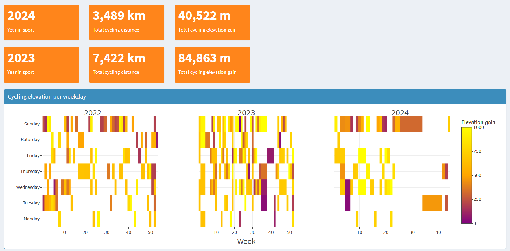
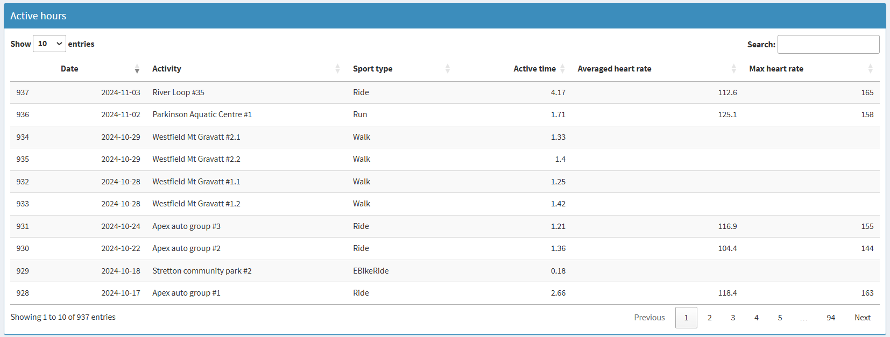
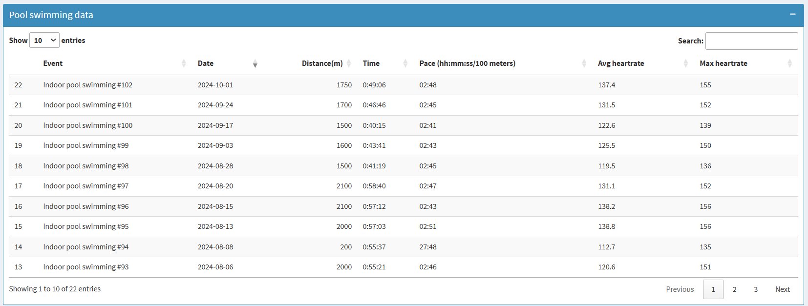

# R Shiny Dashboard: Strava Activity Data

## Introduction
This repository contains an interactive R Shiny application that connects to the Strava API to retrieve and visualise activity data from a single user. The app provides insights into activity trends, performance metrics, and much more in an engaging and user-friendly interface.

---

## Features
- **Data Retrieval**: Fetches activity data directly from the Strava API and Google sheet
- **Visualisations**: Includes interactive plots, static plots and metrics for activity summaries, trends, and comparisons.
- **Interactivity**: Offers hovertext, tables with search and sorting features for detailed analysis.

---

## Demo
You can view the live app here: [Strava activity data](https://luenhchang.shinyapps.io/Strava-activity-data/).

---

## Screenshots

### Activity Trends Dashboard


---



---



---

### Tables


---



---

## Installation
To run this application locally:
1. Clone this repository:
```bash
   git clone https://github.com/luenhchang/R-Shiny-dashboard_Strava-activity-data.git
```

---

## Updates
**2025-02-03**:
* Sorted data by start.date.local and start.datetime.local to ensure correct stacking order in Plotly stacked bar chart of daily active hour in 2025 in server.R
* Replaced `DT::dataTableOutput()` with `DT::DTOutput()` in ui.R

**2025-01-24**:
* Added elapsed hours to active time tab table

**2025-01-22**:
* Added total elapsed hours valueBox to This Week's Fitness Highlights

**2025-01-21**:
* Created 3 valueBoxes for This Week Progress that mimics Strava's weekly progress dashboard in 2024
* Wrote valueBox(subtitle=) argument in a column of the data.frame stats`

**2025-01-18**:
* Included Gardening in top left-aligned legend of Activity Hours in 2025 plot

**2025-01-02**:
* Added stacked bar chart for active hours in 2025
* Added most or least active months in 2 infoBoxes

**2024-12-31**:
* Included Lawn mowing in top left-aligned legend of Activity Hours in 2024 plot
* Added Lawn mowing in activity.type in 2024 data

**2024-12-19**:
* Moved custom functions from `global.R` and `server.R` to `functions.R`
* Sorted all DT dataTables by descending orders of Date and Activity
* Updated Plotly bar plot to show every month on the X axis
* Changed `Moving time` from lubridate to character to keep 'xxH xxM xxS' format in DT dataTables

**2024-11-04**
* Calculated proportion of days with active hours in a current year or past year. This proportion is ranged between 0 and 100% considering if the year is a leap year.